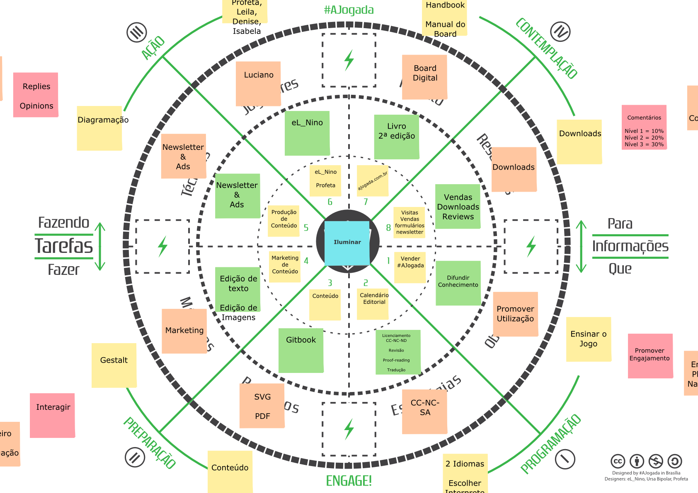

## Prop&oacute;sito do Projeto

O Projeto #ajogada &eacute; bem mais do que uma metodologia de gamifica&ccedil;&atilde;o. O Projeto &eacute; uma rede de pessoas colaborando em iniciativas criativas diversas tendo como princ&iacute;pio a vis&atilde;o de jogos desenvolvida pela metodologia A Jogada. 

### O Jogo do Projeto

(inserir link para o svg)

### Roadmap